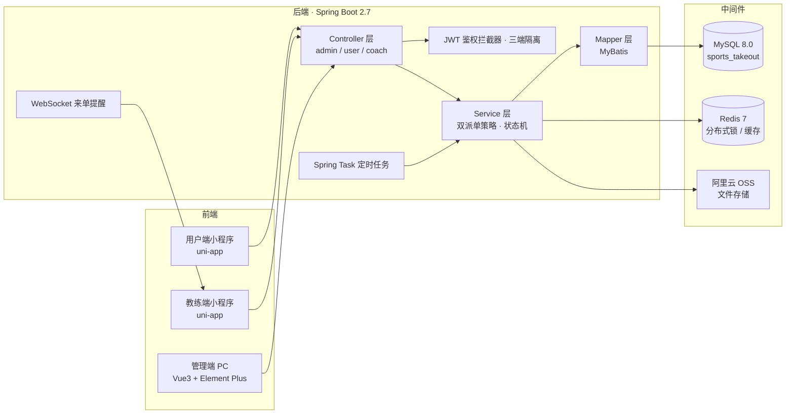
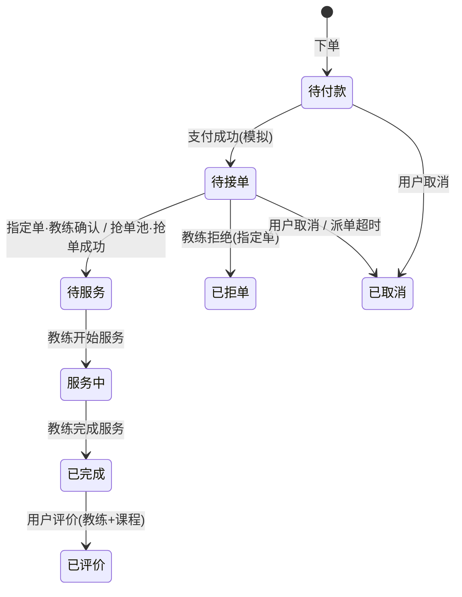

# 体育外卖 · 上门私教平台

> 基于 **Spring Boot 2.7 + uni-app** 的上门私教 O2O 平台。完整实现「浏览课程 → 选教练 → 约时段 → 支付 → 接单 → 上门服务 → 评价 → 结算」全流程闭环，支持**双派单模型**（指定教练 + 抢单池）。

[](LICENSE)


---

## 📖 项目简介

「体育外卖」虽带"外卖"二字，业务本质是**上门服务 O2O**：教练携带便携器械（弹力带、壶铃、瑜伽垫、体脂秤等）上门，为客户提供一对一的科学减脂/增肌/拉伸/产后恢复服务。行业造词称之为「体育外卖」。

**一句话价值：把健身房搬到家里** —— 用户下单约教练，教练带器械上门做科学减脂运动。

系统由三端组成：

| 角色 | 端 | 形态 |
|---|---|---|
| 用户（减脂客户） | 用户端 | 微信小程序（uni-app） |
| 教练 | 教练端 | 微信小程序（uni-app） |
| 平台运营 | 管理端 | PC Web（Vue 3 + Element Plus） |

---

## 🎯 核心亮点

- **双派单状态机**：同一订单走「指定教练」或「抢单池」两条链路，用策略模式区分，完整覆盖 1 待付款 → 2 待接单 → 3 待服务 → 4 服务中 → 5 已完成，以及 6 已取消 / 7 拒单。
- **并发控制**：排期**乐观锁**防同排期被多人预约；抢单用 **Redis SETNX 分布式锁 + 乐观锁 CAS** 防同一订单被多教练同时抢。
- **三端 JWT 鉴权隔离**：管理端 / 用户端 / 教练端各自独立密钥 + 独立拦截器。
- **定时任务兜底**：派单池超时未派自动取消（Spring Task）。
- **WebSocket 来单提醒**：新订单实时推送教练端。

---

## 🖼 界面截图

### 用户端 · 课程浏览


### 教练端 · 工作台


### 管理端 · 教练审核


---

## 🧭 三端功能

### 用户端（微信小程序 · 10 页）
浏览课程/分类/详情 · 教练列表（按评分/等级筛选）· 两种下单（指定教练 / 就近派单）· 时段预约 · 模拟支付 · 订单状态跟踪 · 双维度评价（教练 + 课程）· 地址管理 · 微信登录

### 教练端（微信小程序 · 8 页）
入驻注册 + 资质上传 · 个人资料 / 排期 / 服务半径 · 接单（指定单确认 / 抢单池抢单）· 订单导航（地址 + 电话）· 开始/完成服务 · 训练记录 + 体测数据上传 · 查看评价

### 管理端（PC Web · 5 页）
教练审核（资质证书预览）· 课程管理（CRUD + 上下架）· 订单管理（搜索 + 详情）· 派单池监控 · 登录

---

## 🏗 系统架构



---

## 🔄 订单状态机



> 状态码：`1` 待付款 / `2` 待接单 / `3` 待服务 / `4` 服务中 / `5` 已完成 / `6` 已取消 / `7` 拒单

---

## 🛠 技术栈

| 层 | 技术 |
|---|---|
| 后端框架 | Spring Boot 2.7.3 + MyBatis |
| 数据库 | MySQL 8.0 |
| 缓存 / 分布式锁 | Redis 7（Spring Data Redis） |
| 鉴权 | JWT（三端独立密钥 + 拦截器） |
| 定时任务 | Spring Task（派单池超时兜底） |
| 实时通信 | WebSocket（来单提醒） |
| 文件存储 | 阿里云 OSS |
| 支付 | 微信支付 SDK（MVP 为模拟支付） |
| 接口文档 | Knife4j (Swagger) |
| 管理端前端 | Vue 3 + Element Plus + Vite |
| 移动端 | uni-app（Vue 2，编译到微信小程序） |

---

## 🗄 数据库设计（14 张表）

| 表 | 说明 | 表 | 说明 |
|---|---|---|---|
| employee | 管理员 | course | 课程（含规格字段） |
| user | 用户（客户） | course_package | 训练套餐 |
| address_book | 上门地址 | package_course | 套餐-课程关联 |
| category | 课程分类 | dispatch_pool | 派单/抢单池 |
| coach | 教练 | orders | 预约订单 |
| coach_certificate | 教练资质证书 | order_detail | 订单明细 |
| coach_schedule | 教练排期 | order_review | 订单评价 |

完整建表脚本：`sql/sports_take_out.sql`（含种子数据）。

---

## 📁 目录结构

```
sports-takeout/
├── README.md                   # 本文档
├── PRD.md                      # 产品需求文档（MVP 边界）
├── DEPLOY.md                   # 部署指南（Docker / 本地）
├── LICENSE                     # AGPL-3.0
├── docker-compose.yml          # 一键部署编排
├── .env.example                # 环境变量模板
├── sql/
│   └── sports_take_out.sql     # 建库 + 建表 + 种子数据（14 张表）
├── sky-take-out/               # 后端工程（Maven 多模块）
│   ├── Dockerfile
│   ├── sky-common/             # 公共模块（工具类 / 常量 / 异常）
│   ├── sky-pojo/               # 实体 / DTO / VO
│   └── sky-server/             # Spring Boot 主工程
│       └── src/main/java/com/sky/
│           ├── controller/     # admin / user / coach 三组 API
│           ├── service/impl/   # 业务逻辑（双派单策略 / 状态机）
│           ├── interceptor/    # JWT 拦截器（三端）
│           └── task/           # 定时任务
├── admin-web/                  # 管理端 PC 前端（Vue3 + Element Plus）
├── uniapp-user/                # 用户端小程序（uni-app）
└── uniapp-coach/               # 教练端小程序（uni-app）
```

---

## 🚀 快速开始

### Docker 一键部署（推荐）

```bash
git clone <仓库地址>
cd sports-takeout
cp .env.example .env        # 按需修改
docker-compose up -d
```

启动后访问：

| 服务 | 地址 |
|---|---|
| 管理端前端 | http://localhost:5173 |
| 接口文档 | http://localhost:8080/doc.html |

### 本地开发

1. 导入数据库：`mysql -u root -p < sql/sports_take_out.sql`
2. 启动后端（在 `sky-take-out/` 下）：`mvn spring-boot:run`（多模块工程，需在 `sky-server` 模块目录下执行）
3. 启动管理端：`cd admin-web && npm install && npm run dev`
4. 小程序用 HBuilderX 导入 `uniapp-user` / `uniapp-coach`，改 `api/request.js` 的 `BASE_URL`

> 详细步骤与常见问题见 **[DEPLOY.md](DEPLOY.md)**。

---

## 👤 演示账号

| 角色 | 端 | 账号 | 密码 |
|---|---|---|---|
| 管理员 | 管理端 http://localhost:5173 | `admin` | `123456` |
| 教练（已审核） | 教练端小程序 | `13900000001`（李教练） | `123456` |
| 教练（待审核） | — | `13900000003`（张教练） | `123456` |
| 用户 | 用户端小程序 | 开发环境 mock 登录 | `POST /user/user/mockLogin` |

> 教练端登录接口：`POST /coach/login`；管理端：`POST /admin/employee/login`。MVP 阶段支付为**模拟支付**，微信登录需自备 appid/secret。

---

## ✅ 端到端验证

以下 10 个接口已全部验证通过（2026-08-24）：

| # | 接口 | 说明 | 状态 |
|---|---|---|---|
| 1 | `POST /admin/employee/login` | 管理端登录 | ✅ |
| 2 | `GET /admin/coach/page` | 教练分页查询 | ✅ |
| 3 | `POST /user/user/mockLogin` | 用户端模拟登录 | ✅ |
| 4 | `GET /user/category/list?type=1` | 课程分类列表 | ✅ |
| 5 | `GET /user/course/list?categoryId=1` | 课程列表 | ✅ |
| 6 | `GET /user/coach/list` | 教练列表 | ✅ |
| 7 | `POST /coach/coach/login` | 教练端登录 | ✅ |
| 8 | `GET /coach/order/dispatchPool` | 教练查派单池 | ✅ |
| 9 | `GET /admin/dispatchPool/list` | 管理端派单池监控 | ✅ |
| 10 | `GET /admin/order/statistics` | 订单统计 | ✅ |

---

## 💳 支付模式说明

| 模式 | 说明 |
|---|---|
| **当前（模拟支付）** | `POST /user/order/payment` 接口直接调用 `paySuccess()` 跳过微信支付，适合开发演示和本地测试 |
| **真实微信支付** | 需自行申请微信支付商户号，在 `application.yml` 配置 `appid/mchid/apiV3Key/证书路径`，并替换 `OrderServiceImpl.payment()` 中的模拟调用为 `WeChatPayUtil.pay()` |

> 代码已集成微信支付 SDK（`WeChatPayUtil`），切换到真实支付只需配置商户号 + 打开注释，无需重写。

---

## 🏷 品牌定制说明

| 定制项 | 位置 | 说明 |
|---|---|---|
| 平台名称 | 小程序 `pages/index` 标题 + 管理端 `App.vue` 侧边栏 | 搜索「体育外卖」替换即可 |
| Logo | 小程序 `static/` + 管理端 `public/` | 替换图片文件 |
| 主题色 | 管理端 `src/styles/` + 小程序 `uni.scss` | 修改 Element Plus / uni-app 主题变量 |
| 课程分类 | 数据库 `category` 表 | 种子数据可自由增删 |

---

## 📝 项目文档

- **[PRD.md](PRD.md)** — 产品需求文档：背景、领域模型映射、订单状态机、MVP 做/不做边界
- **[DEPLOY.md](DEPLOY.md)** — 部署指南：Docker 一键部署 / 本地开发 / 常见问题

---

## 🙏 致谢与声明

本项目基于「**苍穹外卖**（sky-take-out，黑马程序员教学项目）」技术骨架二次开发，将餐饮外卖领域模型重构为「上门私教」业务领域，感谢原项目提供的脚手架基础。

> ⚠️ 本项目为学习交流与作品展示用途。因底座涉及第三方教学项目代码，若计划商用，请自行评估版权合规性。

---

## 📄 开源协议与商业授权

本项目采用 **AGPL-3.0** 协议发布，详见 [LICENSE](LICENSE)。

| 用途 | 是否免费 | 说明 |
|---|---|---|
| 个人学习 / 研究 | 免费 | 保留版权声明即可 |
| 商业使用（上线运营 / 二次开发后部署） | **需购买商业授权** | AGPL 要求公开源码，购买商业授权可免除该义务 |
| 二次开发后闭源销售 | **需购买商业授权** | 同上 |

> 商业授权联系方式：请在 GitHub Issues 留言或联系项目维护者。
