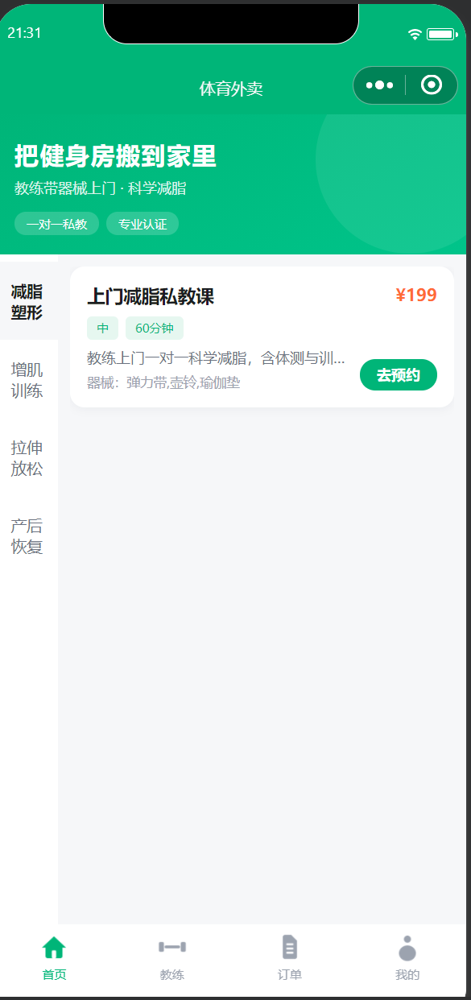
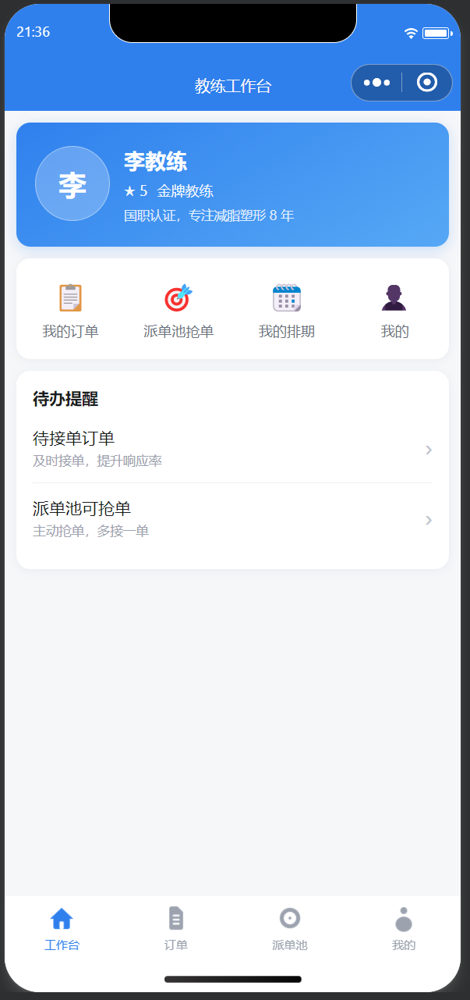
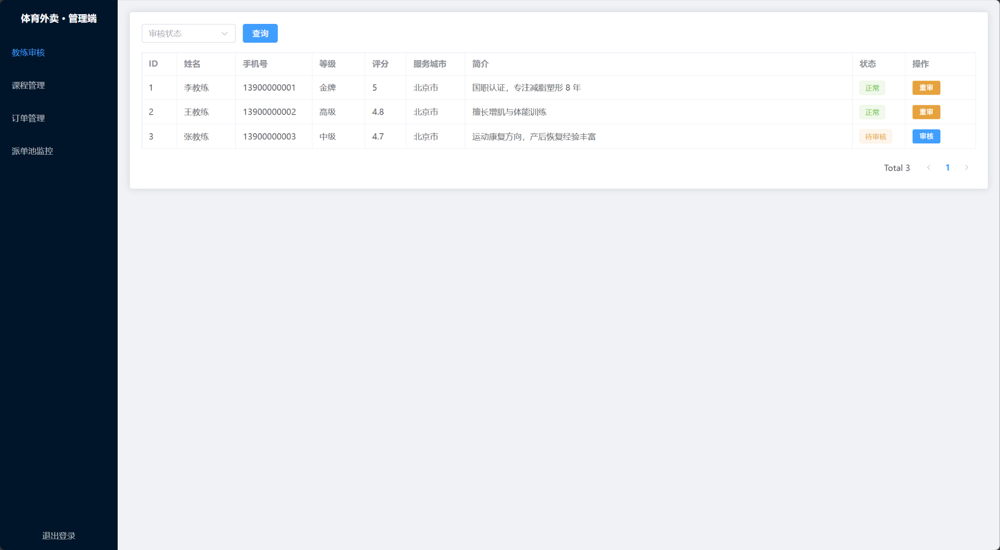
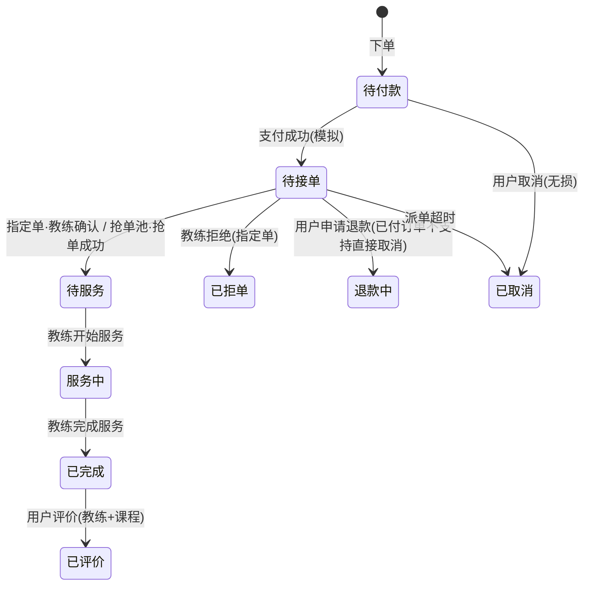
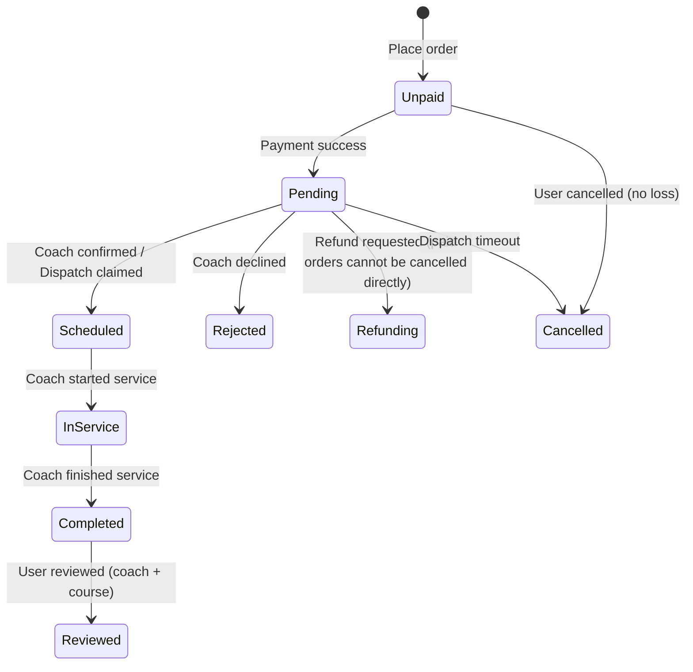

<div align="center">

# 体育外卖 · AI 智能体平台

**基于 Spring Boot + LangGraph 的上门私教 O2O 智能服务系统**

[](https://www.python.org/)
[](https://langchain-ai.github.io/langgraph/)
[](https://spring.io/)
[](https://vuejs.org/)
[](https://fastapi.tiangolo.com/)
[](https://github.com/muyiyang09/sports-takeout/stargazers)
[](#许可证-license)

[中文](#项目介绍) | [English](#english)

---

</div>

## 项目介绍

**体育外卖**（Sports Takeout）是一个面向上门私教 O2O 场景的智能服务平台，核心定位是"**把健身房搬到家里**"——教练携带便携器械上门，为用户提供科学的减脂、增肌、拉伸、产后恢复等一对一训练服务。

本项目在传统 O2O 业务系统之上，构建了一套独立的 **AI 微服务**（`ai-service`），基于 LangGraph Agent 框架，实现教练智能推荐、课程评价摘要、教练资质智能审核等 AI 能力，打造"业务系统 + AI 智能体"的双引擎架构。

> 🇨🇳 项目动机源自《全民健身计划（2026—2030）》提出的科学健身指导供给缺口——政策文件里 "每千人 3.3 名社会体育指导员" 的目标，正是本平台要用数字化手段补上的空缺。

## 🎯 为什么值得你花 15 分钟

这不是一个 CRUD Demo。**LangGraph Agent 工程化中所有真正难的点——多 Agent 协作、HITL 人工介入、Checkpointer 状态持久化、混合检索 RAG、缓存穿透/击穿/雪崩三防、跨语言 MCP 工具层——都在这个仓库里被真实落地过一遍**，并且每一条都配有可运行代码和踩坑记录。

如果你正在准备 AI 工程化方向的面试或做技术选型，直接按表索骥：

| 你关心的主题 | 直接看这几篇 |
|---|---|
| 多 Agent 协作 & Supervisor 路由降级 | [08-多Agent实现](ai-service/docs/08-多Agent实现.md) |
| 混合检索 RAG（BM25 + 向量 + RRF 调参） | [04-RAG混合检索](ai-service/docs/04-RAG混合检索.md) |
| 循环工程 / HITL / Checkpointer / RedisSaver | [03-循环工程](ai-service/docs/03-循环工程.md) · [10-上线检查清单](ai-service/docs/10-上线检查清单.md) |
| 缓存三防 / 分布式锁防死锁 / 熔断限流 | [05-商业化加固](ai-service/docs/05-商业化加固.md) |
| MCP 跨语言工具层 | [07-MCP工具层](ai-service/docs/07-MCP工具层.md) |
| ⭐ **Agent 高频面试题（40+ 题 + 场景面经 + 速记话术）** | [09-Agent面试题集](ai-service/docs/09-Agent面试题集.md) · [11-Agent场景面经](ai-service/docs/11-Agent场景面经.md) · [12-面试速记话术](ai-service/docs/12-面试速记话术.md) |



如果对你有帮助，右上角点个 **⭐ Star** 让更多 AI 学习者看到这份资料。这是它持续更新的最大动力。

## 核心亮点

- **🤖 多 Agent 架构**：教练推荐 Agent + 评价摘要 Agent + 证书审核 Agent + Supervisor 调度
- **🔍 混合检索 RAG**：BM25 稀疏检索 + 向量召回（Milvus/Chroma/pgvector）+ RRF 融合
- **🔄 Loop 工程**：条件分支路由、失败重试循环、HITL 人工介入、自我反思
- **🛡️ 工程化加固**：分布式锁防死锁、Checkpointer 状态持久化、限流熔断、Token 预算管控
- **🔐 安全加固**：三端 JWT 隔离 + 服务间共享密钥鉴权、越权校验全覆盖、支付幂等、AES-GCM 敏感数据加密、缓存穿透/击穿/雪崩三防、RBAC 角色切面、操作审计表
- **🔌 MCP 工具层**：跨语言工具复用，Spring Boot 业务接口暴露为 MCP Tool 供 AI 调用
- **📊 可观测性**：审计日志、Prometheus/Grafana/Alertmanager 全套指标告警、Trace 链路追踪
- **🏗️ 双派单模型**：指定教练 + 抢单池两种派单模式，完整状态机覆盖全流程

## 系统架构

```mermaid
flowchart TB
    subgraph 前端
        U[用户端微信小程序]
        C[教练端微信小程序]
        A[管理端 Web]
    end

    subgraph 后端
        direction TB
        SB[Spring Boot 主后端]
        AI[AI 微服务 · FastAPI + LangGraph]
    end

    subgraph 存储
        MySQL[(MySQL 8.0)]
        Redis[(Redis 7)]
        Vec[(Milvus / Chroma / pgvector)]
    end

    subgraph AI Agents
        direction LR
        A1[教练推荐 Agent]
        A2[评价摘要 Agent]
        A3[证书审核 Agent]
        A4[Supervisor 调度]
    end

    subgraph RAG 层
        BM25[BM25 稀疏检索]
        EMB[向量 Embedding]
        RRF[RRF 融合]
    end

    U --> SB
    C --> SB
    A --> SB
    SB --> MySQL
    SB --> Redis
    SB -->|AI 调用| AI

    AI --> A4
    A4 --> A1
    A4 --> A2
    A4 --> A3

    A1 --> RAG 层
    RAG 层 --> Vec
    A1 --> MySQL
    A2 --> MySQL
    A3 --> MySQL

    AI --> Redis
    AI -->|只读| MySQL
```

## AI 微服务详解

### 教练推荐 Agent（recommend_coach）

三节点串行 DAG 流程：

1. **Node 1 · 意图抽取**（LLM）：用户自然语言 → 结构化意图（城市、项目、预算、时段等）
2. **Node 2 · 检索排序**（纯规则）：MySQL 查询 + 五维加权打分（评分/语义/等级/距离/档期）
3. **Node 3 · 理由生成**（LLM）：候选结果 → 2-3 句个性化推荐理由

### 评价摘要 Agent（review_summary）

批量分析历史用户评价，自动打标签并生成摘要。

### 证书审核 Agent（cert_review）

OCR + 数据库比对 + HITL 人工确认的教练资质审核流程。

### Supervisor 调度

统一入口，根据用户意图路由到对应子 Agent，支持降级策略。

## 快速开始

### 前置要求

- Docker & Docker Compose
- Python 3.11+
- JDK 21+
- Node.js 18+

### 一键部署（推荐）

```bash
git clone <仓库地址>
cd sports-takeout

# 配置环境变量
cp .env.example .env
# 编辑 .env 填写 API Key 和密码

# 一键启动所有服务（含 AI 微服务）
docker-compose up -d
```

启动后访问：

| 服务 | 地址 | 说明 |
|------|------|------|
| 管理端前端 | http://localhost:5173 | Vue3 管理后台 |
| Spring Boot API | http://localhost:8080 | Knife4j 文档：/doc.html |
| AI 微服务 | http://127.0.0.1:18000 | 仅本机可达，需 x-service-token 鉴权 |
| Milvus | localhost:19530 | 向量库（etcd+minio 三服务栈） |
| Prometheus / Grafana | :9090 / :3000 | 指标采集与可视化面板 |
| Alertmanager | :9093 | 告警路由（钉钉/飞书 webhook） |

> ⚠️ `.env` 中以下变量为必填（缺失则 compose 启动报错）：`MYSQL_ROOT_PASSWORD`、`MYSQL_APP_PASSWORD`、`REDIS_PASSWORD`、`MILVUS_MINIO_ACCESS_KEY`、`MILVUS_MINIO_SECRET_KEY`。安全基线详见 [DEPLOY.md](DEPLOY.md)。

### AI 微服务本地开发

```bash
cd ai-service

# 安装依赖（推荐使用 uv 或 pip）
pip install -e ".[dev]"

# 配置环境变量
cp .env.example .env
# 编辑 .env 填写 LLM API Key、MySQL/Redis 连接等

# 启动服务
python -m app.main

# 运行测试
pytest tests/ -v
```

### API 接口

> 业务接口统一前缀 `/v1/ai`，需携带 `x-service-token` 请求头（与后端共享的 `SERVICE_AUTH_TOKEN`）。

| Method | Path | 说明 |
|--------|------|------|
| GET | `/healthz` | 健康检查 |
| GET | `/readyz` | 就绪探针（含依赖检查） |
| POST | `/v1/ai/recommend-coach` | 教练智能推荐 |
| POST | `/v1/ai/review-summary` | 评价摘要生成 |
| POST | `/v1/ai/cert-review` | 证书智能审核 |
| POST | `/v1/ai/feedback` | 用户反馈回流（点赞/点踩/下单） |

**推荐请求示例：**
```json
POST /v1/ai/recommend-coach
Headers: x-service-token: <SERVICE_AUTH_TOKEN>
{
  "user_query": "望京，预算200以内，想产后恢复，周末上午",
  "city_code_override": null,
  "top_n": 3
}
```

**推荐响应示例：**
```json
{
  "intent": {
    "city": "北京",
    "district": "望京",
    "specialization": "产后恢复",
    "tags": ["周末", "上午"],
    "price_max": 200
  },
  "candidates": [
    {"coach_id": 1, "total_score": 0.89, "dimensions": {"rating": 0.4, "semantic": 0.32, "level": 0.09, "distance": 0.06, "slot": 0.02}}
  ],
  "recommend_reason": "针对您的产后恢复需求，推荐张教练...",
  "matched_course_name": "上门产后恢复私教课",
  "matched_course_price": 199.0,
  "over_budget": false
}
```

## 项目结构

```
sports-takeout/
├── README.md                      # 项目说明（中英双版）
├── LICENSE                        # 非商业使用许可
├── PRD.md                         # 产品需求文档
├── DEPLOY.md                      # 部署指南
├── docker-compose.yml             # Docker 一键部署编排（含 Milvus 栈 + 可观测栈）
├── .env.example                   # 环境变量模板
├── scripts/
│   ├── smoke_test.sh              # 端到端冒烟测试
│   └── backup_mysql.sh            # MySQL 每日备份
├── prometheus/                    # Prometheus 采集配置 + Alertmanager 告警路由
├── sql/
│   ├── sports_take_out.sql        # 业务库建表 + 种子数据
│   └── 07-idempotency-indexes.sql # 幂等唯一索引 + 应用账号授权
│
├── ai-service/                    # AI 微服务（核心）
│   ├── app/
│   │   ├── clients/               # 外部客户端（LLM/DB/Redis/向量/Embedding/Reranker）
│   │   ├── core/                  # 核心能力（Checkpoint/Session/安全/审计/指标）
│   │   ├── eval/                  # 评估框架（Judge/Metric/Runner）
│   │   ├── graphs/                # Agent 图谱（Supervisor/Recommend/Review/Cert）
│   │   ├── mcp/                   # MCP 工具层（Server/Client）
│   │   ├── middleware/            # 中间件（限流/Token预算/RequestID）
│   │   ├── prompts/               # Prompt 模板（YAML 配置）
│   │   ├── schemas/               # 数据模型（Pydantic Schema）
│   │   ├── tools/                 # 工具注册（CoachTools/ReviewTools）
│   │   ├── config.py              # 强类型配置中心
│   │   └── main.py                # FastAPI 入口
│   ├── docs/                      # AI 工程文档（12 份）
│   ├── tests/                     # 单元测试
│   └── pyproject.toml             # Python 项目配置
│
├── sky-take-out/                  # Spring Boot 主后端
│   ├── sky-common/                # 公共模块（常量/异常/工具）
│   ├── sky-pojo/                  # 实体/DTO/VO
│   └── sky-server/                # Spring Boot 主工程
│
├── admin-web/                     # 管理端 Web（Vue 3 + Element Plus）
│
└── docs/                          # 截图等资源
```

## 技术栈

### 后端（Spring Boot）

| 技术 | 版本 | 用途 |
|------|------|------|
| Spring Boot | 3.5.16 | 主后端框架 |
| MyBatis | 3.0.4 | ORM |
| MySQL | 8.0 | 业务数据库 |
| Redis | 7 | 缓存/分布式锁 |
| JWT | - | 三端鉴权隔离 |
| WebSocket | - | 实时消息推送 |

### AI 微服务

| 技术 | 版本 | 用途 |
|------|------|------|
| Python | 3.11+ | 开发语言 |
| LangGraph | 1.1.4 | Agent 编排框架 |
| langchain-core | ≥1.0 | 消息核心 |
| LiteLLM | 1.55.3 | LLM 多供应商路由 |
| Pydantic | 2.10.4 | 强类型数据校验 |
| FastAPI | 0.115.6 | HTTP 服务框架 |
| uvicorn | 0.32.1 | ASGI 服务器 |
| SQLAlchemy | 2.0.36 | 数据库访问 |
| Redis (python) | 7.4.1 | 缓存/Checkpointer |
| langgraph-checkpoint-redis | 0.5.2 | 生产级状态持久化 |
| rank-bm25 | 0.2.2 | 稀疏检索 |
| Milvus 2.4 / Chroma / pgvector | - | 向量存储（环境变量切换后端） |

### 前端

| 技术 | 版本 | 用途 |
|------|------|------|
| uni-app | 2.x | 微信小程序（用户端/教练端） |
| Vue 3 + Element Plus | 3.x | 管理端 PC Web |

## 配置说明

### 根目录 .env（docker-compose 部署）

```env
# ===== 必填：缺失 compose 启动即报错 =====
MYSQL_ROOT_PASSWORD=          # MySQL root（仅初始化用）
MYSQL_APP_PASSWORD=           # 应用账号 sports_app 密码（业务连接用）
REDIS_PASSWORD=               # Redis requirepass
MILVUS_MINIO_ACCESS_KEY=      # Milvus 内部对象存储凭据（禁用默认 minioadmin）
MILVUS_MINIO_SECRET_KEY=

# ===== 强烈建议填写 =====
SKY_JWT_ADMIN_KEY=            # 三端 JWT 密钥（openssl rand -hex 32）
SKY_JWT_USER_KEY=
SKY_JWT_COACH_KEY=
SKY_AES_KEY=                  # 身份证号 AES-GCM 加密密钥（16/24/32 字节）
SERVICE_AUTH_TOKEN=           # 后端 ↔ ai-service 机器间鉴权共享密钥
LLM_API_KEY=                  # DeepSeek 等 LLM Key
```

### AI 微服务核心配置

```env
# ===== LLM 配置 =====
LLM_MODEL=deepseek/deepseek-chat
LLM_API_KEY=your-api-key
LLM_BASE_URL=

# ===== 数据库（只读现有库） =====
MYSQL_HOST=mysql
MYSQL_USER=sports_app         # 生产禁用 root，走最小权限应用账号
REDIS_PASSWORD=                # 与根目录 REDIS_PASSWORD 一致

# ===== 向量库后端选择 =====
# milvus（容器部署默认）/ chroma（开发）/ pgvector（生产可选）
MILVUS_URI=http://milvus:19530

# ===== 功能开关 =====
CHECKPOINTER_BACKEND=redis    # SERVICE_ENV=prod 时默认 redis；memory 仅限开发
```

详细配置项见 [ai-service/.env.example](ai-service/.env.example)。

## 三端功能

### 用户端（微信小程序）
课程浏览/分类/详情 · 教练列表 · 两种下单（指定/派单）· 时段预约 · 订单跟踪 · 双维评价 · 地址管理 · 微信登录

### 教练端（微信小程序）
入驻注册 · 资质上传 · 排期管理 · 接单/抢单 · 订单导航 · 服务上报 · 训练记录 · 评价查看

### 管理端（PC Web）
教练审核 · 课程管理 · 订单管理 · 派单池监控 · AI 审计日志查看


## 界面截图

### 用户端 · 课程浏览


### 教练端 · 工作台


### 管理端 · 教练审核


## 订单状态机



> 状态码：`1` 待付款 / `2` 待接单 / `3` 待服务 / `4` 服务中 / `5` 已完成 / `6` 已取消 / `7` 拒单

## 数据库设计（14 张表）

| 表 | 说明 | 表 | 说明 |
|---|---|---|---|
| employee | 管理员 | course | 课程（含规格字段） |
| user | 用户（客户） | course_package | 训练套餐 |
| address_book | 上门地址 | package_course | 套餐-课程关联 |
| category | 课程分类 | dispatch_pool | 派单/抢单池 |
| coach | 教练 | orders | 预约订单 |
| coach_certificate | 教练资质证书 | order_detail | 订单明细 |
| coach_schedule | 教练排期 | order_review | 订单评价 |

完整建表脚本：`sql/sports_take_out.sql`（含种子数据）。

## 支付模式说明

| 模式 | 说明 |
|------|------|
| **当前（模拟支付）** | `POST /user/order/payment` 接口直接调用 `paySuccess()` 跳过微信支付，适合开发演示和本地测试 |
| **真实微信支付** | 需自行申请微信支付商户号，在 `application.yml` 配置 `appid/mchid/apiV3Key/证书路径`，并替换 `OrderServiceImpl.payment()` 中的模拟调用为 `WeChatPayUtil.pay()` |

> 代码已集成微信支付 SDK（`WeChatPayUtil`），切换到真实支付只需配置商户号 + 打开注释，无需重写。
>
> 💰 资金规则：已付款订单不支持直接取消（防止"钱收了单没了"），必须走申请退款流程；待付款订单可无损取消。支付回调带验签与幂等短路。

## 品牌定制说明

| 定制项 | 位置 | 说明 |
|---|---|---|
| 平台名称 | 小程序 `pages/index` 标题 + 管理端 `App.vue` 侧边栏 | 搜索「体育外卖」替换即可 |
| Logo | 小程序 `static/` + 管理端 `public/` | 替换图片文件 |
| 主题色 | 管理端 `src/styles/` + 小程序 `uni.scss` | 修改 Element Plus / uni-app 主题变量 |
| 课程分类 | 数据库 `category` 表 | 种子数据可自由增删 |

## 致谢与声明

本项目基于「**苍穹外卖**」（sky-take-out，黑马程序员教学项目）技术骨架二次开发，将餐饮外卖领域模型重构为「上门私教」业务领域，感谢原项目提供的脚手架基础。

> ⚠️ 本项目为学习交流与作品展示用途。AI 微服务模块为自主研发，业务底座部分基于第三方教学项目重构。
## 演示账号

| 角色 | 账号 | 密码 |
|------|------|------|
| 管理员（管理端） | admin | 123456 |
| 教练（已审核） | 13900000001 | 123456 |
| 教练（待审核） | 13900000003 | 123456 |
| 用户（开发环境） | mock 登录 | POST /user/user/mockLogin |


## 端到端验证

以下 10 个接口已全部验证通过（2026-08-24）：

| # | 接口 | 说明 | 状态 |
|---|------|------|------|
| 1 | `POST /admin/employee/login` | 管理端登录 | ✅ |
| 2 | `GET /admin/coach/page` | 教练分页查询 | ✅ |
| 3 | `POST /user/user/mockLogin` | 用户端模拟登录 | ✅ |
| 4 | `GET /user/category/list?type=1` | 课程分类列表 | ✅ |
| 5 | `GET /user/course/list?categoryId=1` | 课程列表 | ✅ |
| 6 | `GET /user/coach/list` | 教练列表 | ✅ |
| 7 | `POST /coach/coach/login` | 教练端登录 | ✅ |
| 8 | `GET /coach/order/dispatchPool` | 教练查派单池 | ✅ |
| 9 | `GET /admin/dispatchPool/list` | 管理端派单池监控 | ✅ |
| 10 | `GET /admin/order/statistics` | 订单统计 | ✅ |

## 项目文档


| 文档 | 说明 |
|------|------|
| [PRD.md](PRD.md) | 产品需求文档：业务背景、领域模型、MVP 边界 |
| [DEPLOY.md](DEPLOY.md) | 部署指南：Docker / 本地开发 / 常见问题 |
| [ai-service/docs/01-项目概览与路线图.md](ai-service/docs/01-项目概览与路线图.md) | AI 服务现状、商业化差距、执行路线图 |
| [ai-service/docs/02-Agent工程能力地图.md](ai-service/docs/02-Agent工程能力地图.md) | Agent 工程能力全景 |
| [ai-service/docs/03-循环工程.md](ai-service/docs/03-循环工程.md) | 条件分支、重试、HITL、refine 循环 |
| [ai-service/docs/04-RAG混合检索.md](ai-service/docs/04-RAG混合检索.md) | BM25 + 向量 + Reranker 混合检索 |
| [ai-service/docs/05-商业化加固.md](ai-service/docs/05-商业化加固.md) | 并发/高可用/工程化加固 |
| [ai-service/docs/06-Harness工程与评估.md](ai-service/docs/06-Harness工程与评估.md) | Eval 数据集、Metric、Trace |
| [ai-service/docs/07-MCP工具层.md](ai-service/docs/07-MCP工具层.md) | MCP Server/Client、跨语言工具复用 |
| [ai-service/docs/08-多Agent实现.md](ai-service/docs/08-多Agent实现.md) | 多 Agent 协同、Supervisor 调度 |
| [ai-service/docs/09-Agent面试题集.md](ai-service/docs/09-Agent面试题集.md) | Agent 技术面试深度题集 |
| [ai-service/docs/10-上线检查清单.md](ai-service/docs/10-上线检查清单.md) | 7 阶段上线检查清单 |

## 许可证 (License)

[](LICENSE)

本项目采用 **AGPL-3.0 + 非商业附加条款** 双重许可。**严禁任何形式的商业用途**。

| 允许 | 禁止 |
|------|------|
| ✅ 个人学习与研究 | ❌ 商业部署与生产使用 |
| ✅ 教育用途（教学/课程） | ❌ 集成到商业 SaaS 或付费服务 |
| ✅ 内部评估与测试 | ❌ 用于提供付费 AI 代理服务 |
| ✅ 开源社区贡献 | ❌ 转售、再许可或分发 |

**详细条款见 [LICENSE](LICENSE) 文件。** 如有合作或特殊授权需求，请联系项目维护者。

---

<a id="english"></a>

## English

# Sports Takeout · AI Agent Platform

**An AI-Powered O2O Personal Training Service System based on Spring Boot + LangGraph**

[](https://www.python.org/)
[](https://langchain-ai.github.io/langgraph/)
[](https://spring.io/)
[](https://vuejs.org/)
[](https://fastapi.tiangolo.com/)
[](https://github.com/muyiyang09/sports-takeout/stargazers)
[](#license)

## ⭐ Why This Repo Is Worth Your Time

This is not another CRUD demo. **Every genuinely hard part of LangGraph agent engineering — multi-agent collaboration, HITL, Checkpointer state persistence, hybrid-retrieval RAG, cache penetration/collapse/avalanche protection, cross-language MCP tool layer — has been implemented for real in this codebase**, each with runnable code and battle-tested lessons.

Preparing for AI engineering interviews or doing tech selection? Go straight to what you need:

| Topic | Read |
|---|---|
| Multi-Agent & Supervisor routing | [Multi-Agent Implementation](ai-service/docs/08-多Agent实现.md) |
| Hybrid RAG (BM25 + Vector + RRF tuning) | [Hybrid Retrieval](ai-service/docs/04-RAG混合检索.md) |
| Loop engineering / HITL / RedisSaver | [Loop Engineering](ai-service/docs/03-循环工程.md) · [Launch Checklist](ai-service/docs/10-上线检查清单.md) |
| Cache protection / distributed locks / circuit breaking | [Production Hardening](ai-service/docs/05-商业化加固.md) |
| MCP cross-language tool layer | [MCP Tool Layer](ai-service/docs/07-MCP工具层.md) |
| **40+ AI Agent interview questions with answers** | [Interview Q&A](ai-service/docs/09-Agent面试题集.md) · [Scenario Questions](ai-service/docs/11-Agent场景面经.md) |

If this repo helps you, please give it a **⭐ Star** — it keeps the project alive.

[Back to Top](#体育外卖--ai-智能体平台)

---

## Overview

**Sports Takeout** is an AI-powered O2O (Online-to-Offline) platform for door-to-door personal training services. Our mission is to **bring the gym to your home** — certified trainers bring portable equipment (resistance bands, kettlebells, yoga mats, body composition scales, etc.) directly to clients' homes for one-on-one scientific training sessions, including fat loss, muscle gain, stretching, and postpartum recovery.

This project extends a traditional O2O business system with an independent **AI microservice** (`ai-service`) built on the LangGraph Agent framework, providing intelligent coach recommendation, review summarization, and certificate verification capabilities — creating a dual-engine architecture combining conventional business logic with AI agents.

## Key Features

- **🤖 Multi-Agent Architecture**: Coach Recommendation Agent + Review Summary Agent + Certificate Verification Agent + Supervisor Router
- **🔍 Hybrid RAG**: BM25 sparse retrieval + vector recall + RRF fusion, with Chroma/pgvector backend switching
- **🔄 Loop Engineering**: Conditional routing, retry loops, HITL (Human-in-the-Loop), self-reflection
- **🛡️ Production Hardening**: Deadlock-free distributed locks, Checkpointer state persistence, rate limiting & circuit breaking, token budget controls
- **🔌 MCP Tool Layer**: Cross-language tool reuse — Spring Boot business interfaces exposed as MCP Tools for AI agents
- **📊 Observability**: Audit logging, metrics, trace tracking, prompt versioning

## Architecture

```mermaid
flowchart TB
    subgraph Frontend
        U[User Mini-Program]
        C[Coach Mini-Program]
        A[Admin Web]
    end

    subgraph Backend
        direction TB
        SB[Spring Boot Main]
        AI[AI Microservice · FastAPI + LangGraph]
    end

    subgraph Storage
        MySQL[(MySQL 8.0)]
        Redis[(Redis 7)]
        Vec[(Milvus / Chroma / pgvector)]
    end

    subgraph AI Agents
        direction LR
        A1[Coach Recommend]
        A2[Review Summary]
        A3[Cert Verification]
        A4[Supervisor]
    end

    subgraph RAG Layer
        BM25[BM25 Sparse]
        EMB[Embedding]
        RRF[RRF Fusion]
    end

    U --> SB
    C --> SB
    A --> SB
    SB --> MySQL
    SB --> Redis
    SB -->|AI Call| AI

    AI --> A4
    A4 --> A1
    A4 --> A2
    A4 --> A3

    A1 --> RAG Layer
    RAG Layer --> Vec
    A1 --> MySQL
    A2 --> MySQL
    A3 --> MySQL

    AI --> Redis
    AI -->|Read-only| MySQL
```

## AI Microservice Details

### Coach Recommendation Agent (recommend_coach)

A three-node serial DAG pipeline:

1. **Node 1 · Intent Extraction** (LLM): Natural language → structured intent (city, specialization, budget, time slot, etc.)
2. **Node 2 · Retrieve & Rank** (Pure rules): MySQL query + 5-dimensional weighted scoring (rating/semantic/level/distance/slot)
3. **Node 3 · Generate Reason** (LLM): Candidates → 2-3 sentence personalized recommendation

### Review Summary Agent (review_summary)

Batch analysis of historical user reviews with automatic tagging and summary generation.

### Certificate Verification Agent (cert_review)

OCR + database comparison + HITL human confirmation for coach certification verification.

### Supervisor Router

Unified entry point that routes user requests to the appropriate sub-agent with degradation support.

## Quick Start

### Prerequisites

- Docker & Docker Compose
- Python 3.11+
- JDK 21+
- Node.js 18+

### One-Command Deployment (Recommended)

```bash
git clone <repo-url>
cd sports-takeout

# Configure environment variables
cp .env.example .env
# Edit .env to set API keys and passwords

# Start all services including AI microservice
docker-compose up -d
```

After startup, access:

| Service | URL | Notes |
|---------|-----|-------|
| Admin Web | http://localhost:5173 | Vue3 admin console |
| Spring Boot API | http://localhost:8080 | Knife4j docs: /doc.html |
| AI Microservice | http://127.0.0.1:18000 | Local-only, requires x-service-token |
| Milvus | localhost:19530 | Vector DB (etcd + minio stack) |
| Prometheus / Grafana | :9090 / :3000 | Metrics & dashboards |
| Alertmanager | :9093 | Alert routing (DingTalk/Feishu webhook) |

> ⚠️ Required `.env` variables (compose fails without them): `MYSQL_ROOT_PASSWORD`, `MYSQL_APP_PASSWORD`, `REDIS_PASSWORD`, `MILVUS_MINIO_ACCESS_KEY`, `MILVUS_MINIO_SECRET_KEY`. See [DEPLOY.md](DEPLOY.md) for the security baseline.

### AI Microservice Local Development

```bash
cd ai-service

# Install dependencies
pip install -e ".[dev]"

# Configure
cp .env.example .env
# Edit .env with LLM API key, MySQL/Redis connection, etc.

# Start the service
python -m app.main

# Run tests
pytest tests/ -v
```

### API Endpoints

| Method | Path | Description |
|--------|------|-------------|
| GET | `/healthz` | Health check |
| GET | `/readyz` | Readiness probe (with dependency checks) |
| POST | `/v1/ai/recommend-coach` | Intelligent coach recommendation |
| POST | `/v1/ai/review-summary` | Review summary generation |
| POST | `/v1/ai/cert-review` | Intelligent certificate verification |
| POST | `/v1/ai/feedback` | User feedback loop (like/dislike/order) |

> All business endpoints require the `x-service-token` header (shared `SERVICE_AUTH_TOKEN`).

**Recommendation Request:**
```json
POST /v1/ai/recommend-coach
Headers: x-service-token: <SERVICE_AUTH_TOKEN>
{
  "user_query": "Wangjing, budget under 200, postpartum recovery, weekend mornings",
  "city_code_override": null,
  "top_n": 3
}
```

**Recommendation Response:**
```json
{
  "intent": {
    "city": "Beijing",
    "district": "Wangjing",
    "specialization": "Postpartum Recovery",
    "tags": ["weekend", "morning"],
    "price_max": 200
  },
  "candidates": [
    {"coach_id": 1, "total_score": 0.89, "dimensions": {"rating": 0.4, "semantic": 0.32, "level": 0.09, "distance": 0.06, "slot": 0.02}}
  ],
  "recommend_reason": "For your postpartum recovery needs, we recommend Coach Zhang...",
  "matched_course_name": "Home Postpartum Recovery Private Session",
  "matched_course_price": 199.0,
  "over_budget": false
}
```

## Project Structure

```
sports-takeout/
├── README.md                      # Project documentation (bilingual)
├── LICENSE                        # Non-Commercial License
├── PRD.md                         # Product Requirements Document
├── DEPLOY.md                      # Deployment Guide
├── docker-compose.yml             # Docker Compose orchestration
├── .env.example                   # Environment variable template
│
├── ai-service/                    # AI Microservice (Core)
│   ├── app/
│   │   ├── clients/               # External clients (LLM/DB/Redis/Vector/Embedding/Reranker)
│   │   ├── core/                  # Core capabilities (Checkpoint/Session/Security/Audit/Metrics)
│   │   ├── eval/                  # Evaluation framework (Judge/Metric/Runner)
│   │   ├── graphs/                # Agent graphs (Supervisor/Recommend/Review/Cert)
│   │   ├── mcp/                   # MCP tool layer (Server/Client)
│   │   ├── middleware/            # Middleware (Rate limit/Token budget/Request ID)
│   │   ├── prompts/               # Prompt templates (YAML config)
│   │   ├── schemas/               # Data models (Pydantic Schemas)
│   │   ├── tools/                 # Tool registry (CoachTools/ReviewTools)
│   │   ├── config.py              # Strong-type configuration center
│   │   └── main.py                # FastAPI entrypoint
│   ├── docs/                      # AI engineering documentation (12 docs)
│   ├── tests/                     # Unit tests
│   └── pyproject.toml             # Python project configuration
│
├── sky-take-out/                  # Spring Boot Main Backend
│   ├── sky-common/                # Common module (constants/exceptions/utils)
│   ├── sky-pojo/                  # Entities/DTOs/VOs
│   └── sky-server/                # Spring Boot main application
│
├── admin-web/                     # Admin Web (Vue 3 + Element Plus)
│
└── docs/                          # Screenshots and resources
```

## Tech Stack

### Backend (Spring Boot)

| Technology | Version | Purpose |
|------------|---------|---------|
| Spring Boot | 3.5.16 | Main backend framework |
| MyBatis | 3.0.4 | ORM |
| MySQL | 8.0 | Business database |
| Redis | 7 | Cache / distributed lock |
| JWT | - | Three-end auth isolation |
| WebSocket | - | Real-time message push |

### AI Microservice

| Technology | Version | Purpose |
|------------|---------|---------|
| Python | 3.11+ | Development language |
| LangGraph | 1.1.4 | Agent orchestration framework |
| langchain-core | ≥1.0 | Messaging core |
| LiteLLM | 1.55.3 | Multi-provider LLM routing |
| Pydantic | 2.10.4 | Strong-type data validation |
| FastAPI | 0.115.6 | HTTP service framework |
| uvicorn | 0.32.1 | ASGI server |
| SQLAlchemy | 2.0.36 | Database access |
| Redis (python) | 7.4.1 | Cache / Checkpointer |
| langgraph-checkpoint-redis | 0.5.2 | Production state persistence |
| rank-bm25 | 0.2.2 | Sparse retrieval |
| Milvus 2.4 / Chroma / pgvector | - | Vector storage (switchable backend) |

### Frontend

| Technology | Version | Purpose |
|------------|---------|---------|
| uni-app | 2.x | WeChat Mini-Program (User/Coach) |
| Vue 3 + Element Plus | 3.x | Admin PC Web |

## Configuration

### Root .env (docker-compose deployment)

```env
# ===== Required: compose fails without these =====
MYSQL_ROOT_PASSWORD=          # MySQL root (init only)
MYSQL_APP_PASSWORD=           # App account sports_app password
REDIS_PASSWORD=               # Redis requirepass
MILVUS_MINIO_ACCESS_KEY=      # Milvus internal object storage creds
MILVUS_MINIO_SECRET_KEY=

# ===== Strongly recommended =====
SKY_JWT_ADMIN_KEY=            # JWT keys for three ends (openssl rand -hex 32)
SKY_JWT_USER_KEY=
SKY_JWT_COACH_KEY=
SKY_AES_KEY=                  # AES-GCM key for ID encryption (16/24/32 bytes)
SERVICE_AUTH_TOKEN=           # Shared secret between backend and ai-service
LLM_API_KEY=                  # DeepSeek etc.
```

### AI Microservice Core Config

```env
LLM_MODEL=deepseek/deepseek-chat
LLM_API_KEY=your-api-key

MYSQL_HOST=mysql
MYSQL_USER=sports_app         # production forbids root; least-privilege app account
REDIS_PASSWORD=

# Vector backend: milvus (container default) / chroma (dev) / pgvector
MILVUS_URI=http://milvus:19530

CHECKPOINTER_BACKEND=redis    # defaults to redis when SERVICE_ENV=prod; memory is dev-only
```

See [ai-service/.env.example](ai-service/.env.example) for all configuration options.

## Three-End Features

### User端 (WeChat Mini-Program)
Course browsing · Coach list · Two order modes (direct/dispatch) · Time slot booking · Order tracking · Dual-dimensional reviews · Address management · WeChat login

### Coach端 (WeChat Mini-Program)
Registration · Certification upload · Schedule management · Order acceptance/claim · Navigation · Service reporting · Training records · Review viewing

### Admin端 (PC Web)
Coach verification · Course management · Order management · Dispatch pool monitoring · AI audit log viewer


## Screenshots

### User App · Course Browsing


### Coach App · Workbench


### Admin Web · Coach Review


## Order State Machine



> Status codes: `1` Unpaid / `2` Pending / `3` Scheduled / `4` In Service / `5` Completed / `6` Cancelled / `7` Rejected

## Database Design (14 Tables)

| Table | Description | Table | Description |
|-------|-------------|-------|-------------|
| employee | Admin | course | Courses |
| user | Customer | course_package | Training packages |
| address_book | Delivery address | package_course | Package-Course relation |
| category | Course category | dispatch_pool | Dispatch/claim pool |
| coach | Coach | orders | Booking orders |
| coach_certificate | Coach certificates | order_detail | Order details |
| coach_schedule | Coach schedule | order_review | Order reviews |

Full schema: `sql/sports_take_out.sql` (with seed data).

## Payment Mode

| Mode | Description |
|------|-------------|
| **Current (Simulated)** | `POST /user/order/payment` directly calls `paySuccess()`, skipping WeChat Pay for dev/demo |
| **Real WeChat Pay** | Apply for merchant ID, configure `appid/mchid/apiV3Key/cert` in `application.yml`, replace mock call with `WeChatPayUtil.pay()` |

> WeChat Pay SDK (`WeChatPayUtil`) is already integrated. Switching to real payment only requires configuration — no code rewrite needed.
>
> 💰 Funds policy: paid orders cannot be cancelled directly (must go through the refund flow); unpaid orders can be cancelled without loss. Payment callbacks carry signature verification and idempotency guards.

## Brand Customization

| Item | Location | Description |
|------|----------|-------------|
| Platform name | Mini-program `pages/index` + Admin `App.vue` | Search & replace '体育外卖' |
| Logo | Mini-program `static/` + Admin `public/` | Replace image files |
| Theme color | Admin `src/styles/` + Mini-program `uni.scss` | Modify Element Plus / uni-app variables |
| Course categories | Database `category` table | Edit seed data freely |

## Acknowledgments

This project is based on the "苍穹外卖" (sky-take-out, a Heima programmer training project) technical skeleton, redeveloped from the food delivery domain to the "door-to-door personal training" domain. Thanks to the original project for providing the scaffolding foundation.

> ⚠️ This project is for learning, communication, and portfolio purposes. The AI microservice module is independently developed; the business foundation is partially refactored from a third-party training project.
## Demo Accounts

| Role | Account | Password |
|------|---------|---------|
| Admin (Admin Web) | admin | 123456 |
| Coach (Verified) | 13900000001 | 123456 |
| Coach (Pending) | 13900000003 | 123456 |
| User (Dev) | Mock login | POST /user/user/mockLogin |


## End-to-End Verification

The following 10 API endpoints have been fully verified (2026-08-24):

| # | Endpoint | Description | Status |
|---|----------|-------------|--------|
| 1 | `POST /admin/employee/login` | Admin login | ✅ |
| 2 | `GET /admin/coach/page` | Coach pagination query | ✅ |
| 3 | `POST /user/user/mockLogin` | User mock login | ✅ |
| 4 | `GET /user/category/list?type=1` | Category list | ✅ |
| 5 | `GET /user/course/list?categoryId=1` | Course list | ✅ |
| 6 | `GET /user/coach/list` | Coach list | ✅ |
| 7 | `POST /coach/coach/login` | Coach login | ✅ |
| 8 | `GET /coach/order/dispatchPool` | Coach dispatch pool | ✅ |
| 9 | `GET /admin/dispatchPool/list` | Admin dispatch pool | ✅ |
| 10 | `GET /admin/order/statistics` | Order statistics | ✅ |

## Documentation


| Document | Description |
|----------|-------------|
| [PRD.md](PRD.md) | Product Requirements Document |
| [DEPLOY.md](DEPLOY.md) | Deployment Guide |
| [ai-service/docs/01-项目概览与路线图.md](ai-service/docs/01-项目概览与路线图.md) | AI service overview and roadmap |
| [ai-service/docs/02-Agent工程能力地图.md](ai-service/docs/02-Agent工程能力地图.md) | Agent engineering capability map |
| [ai-service/docs/03-循环工程.md](ai-service/docs/03-循环工程.md) | Loop engineering (branch/retry/HITL) |
| [ai-service/docs/04-RAG混合检索.md](ai-service/docs/04-RAG混合检索.md) | Hybrid RAG retrieval |
| [ai-service/docs/05-商业化加固.md](ai-service/docs/05-商业化加固.md) | Production hardening |
| [ai-service/docs/06-Harness工程与评估.md](ai-service/docs/06-Harness工程与评估.md) | Evaluation and harness |
| [ai-service/docs/07-MCP工具层.md](ai-service/docs/07-MCP工具层.md) | MCP tool layer |
| [ai-service/docs/08-多Agent实现.md](ai-service/docs/08-多Agent实现.md) | Multi-Agent implementation |
| [ai-service/docs/09-Agent面试题集.md](ai-service/docs/09-Agent面试题集.md) | Agent interview Q&A collection |
| [ai-service/docs/10-上线检查清单.md](ai-service/docs/10-上线检查清单.md) | Production launch checklist |

## License

[](#license)

This project is licensed under **AGPL-3.0 + Non-Commercial Additional Terms**. **All commercial use is strictly prohibited.**

| Allowed | Prohibited |
|---------|------------|
| ✅ Personal learning & research | ❌ Commercial deployment |
| ✅ Educational use (teaching/coursework) | ❌ Integration into commercial SaaS |
| ✅ Internal evaluation & testing | ❌ Paid AI agent services |
| ✅ Open-source community contributions | ❌ Resale or sublicensing |

See the full [LICENSE](LICENSE) file for details. For collaboration or special licensing, please contact the project maintainers.

## Star History

[](https://star-history.com/#muyiyang09/sports-takeout&Date)
